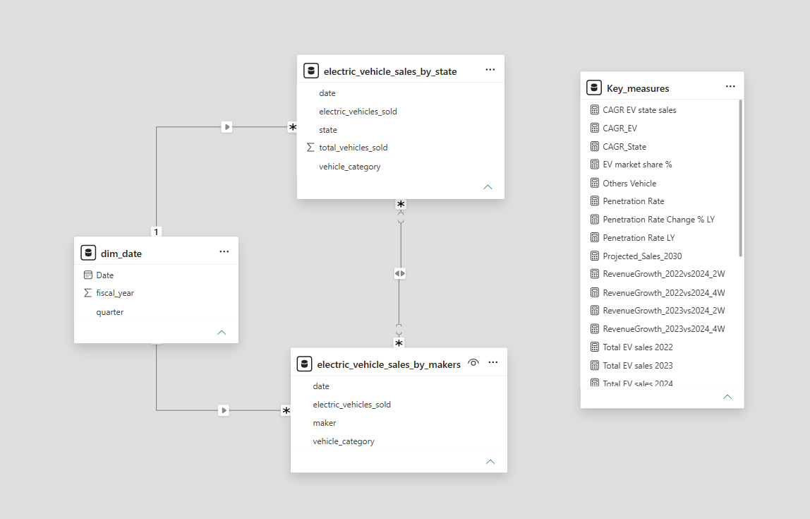
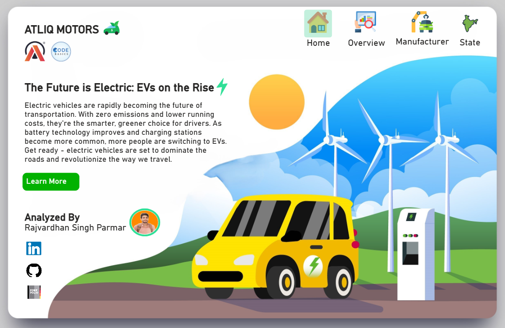
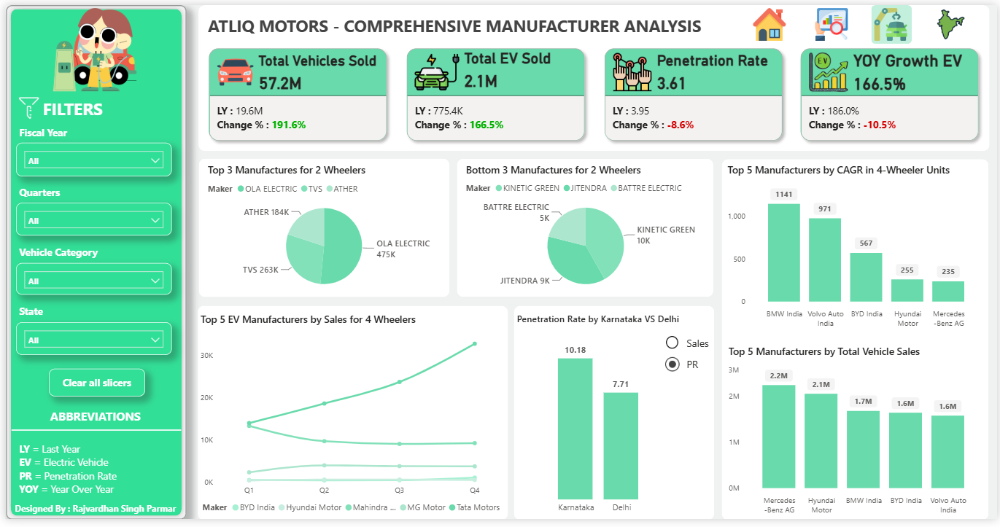
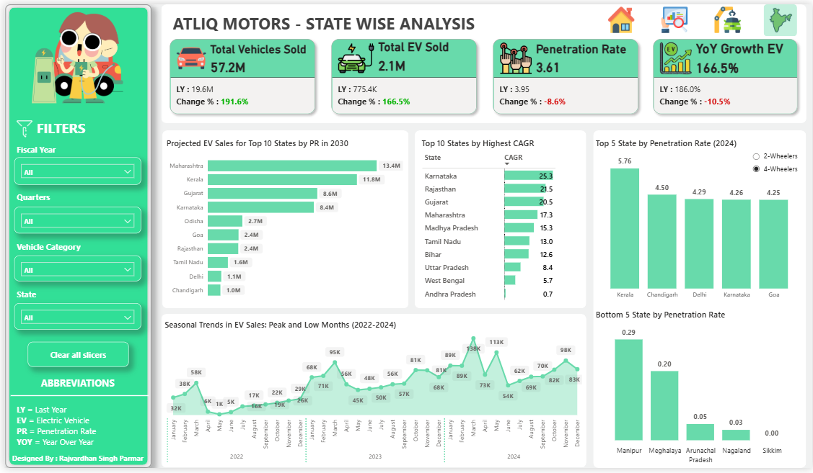

# 🚗 EV Market & Sales Performance Analysis — India


## 📌 Project Overview

This project analyzes India's Electric Vehicle (EV) market to support **AtliQ Motors' market-entry assessment**.

AtliQ Motors is an automotive company from the USA specializing in electric vehicles. After achieving a 25% market share in the electric and hybrid vehicle segment in North America, the company is considering expanding into India, where its market share is less than 2%.

Before launching its bestselling EV models in India, the management team wants to understand the existing Indian EV market, including:

* EV adoption across different states
* Market growth over time
* EV penetration rates
* Leading EV manufacturers
* 2-wheeler vs 4-wheeler trends
* Manufacturer market share
* State-level growth opportunities
* Future EV sales potential

To address these questions, I analyzed **40K+ records from Vahan Sewa** and developed an interactive **Power BI dashboard** using Power Query, data modeling, and DAX.

---

# 🎯 Business Problem

AtliQ Motors wants to enter the Indian EV market but lacks sufficient understanding of the existing market landscape.

The key business questions are:

1. Which Indian states have the highest EV adoption?
2. Which states are experiencing the fastest EV growth?
3. Which states have the highest EV penetration?
4. Which EV manufacturers currently dominate the market?
5. How does the market differ between 2-wheelers and 4-wheelers?
6. Which manufacturers are growing rapidly?
7. How is EV market share distributed among manufacturers?
8. What are the quarterly and yearly EV sales trends?
9. What could the EV market look like by 2030?
10. Which markets and segments could be attractive for AtliQ Motors?

---

# 📊 Dataset

### Data Source

**Vahan Sewa**

The dataset contains approximately **40K+ records** related to vehicle registrations/sales and includes information that enables analysis across:

* States
* Manufacturers
* Vehicle categories
* Fiscal years
* Quarters
* EV sales
* Total vehicle sales

The data was prepared and transformed before being used for the Power BI analysis.

---

# 🛠️ Tools & Technologies

| Tool                | Purpose                                                 |
| ------------------- | ------------------------------------------------------- |
| **Microsoft Excel** | Initial data handling and preparation                   |
| **Power Query**     | Data cleaning and transformation                        |
| **Power BI**        | Data modeling, dashboard development and visualization  |
| **DAX**             | KPI calculations, growth analysis, CAGR and projections |

---

# 🔄 Project Workflow

The project followed an end-to-end data analytics workflow:

```text
Vahan Sewa Dataset
        ↓
Data Preparation
        ↓
Power Query Transformation
        ↓
Data Modeling
        ↓
DAX Measures
        ↓
Power BI Dashboard
        ↓
Market Analysis
        ↓
Insights & Recommendations
```

---

# 🧹 Data Preparation

The raw dataset was prepared before analysis using **Excel and Power Query**.

The preparation process included transforming the source data into a structure suitable for analysis and reporting.

The cleaned data was then loaded into Power BI for modeling and analysis.

---

# 🏗️ Data Modeling

I created the Power BI data model.

The model includes a dedicated **Date Dimension** and tables containing EV sales information at different analytical levels.

### Main components

* `Dim_date`
* `electric_vehicle_sales_by_state`
* `electric_vehicle_sales_by_makers`

The date dimension enables analysis by:

* Fiscal Year
* Quarter
* Month
* Year-over-Year performance

The model was designed to support state-level, manufacturer-level and time-based analysis.

---

# 📐 DAX & Key Measures

I created the DAX measures used throughout the dashboard.

Key calculations include:

### Total EV Sales

Measures the total number of EVs sold/registered within the selected context.

### EV Market Share

Used to compare the contribution of different manufacturers within the EV market.

### EV Penetration Rate

Measures EV adoption relative to total vehicle sales.

### YoY Growth

Used to evaluate year-over-year changes in EV sales.

### CAGR

Used to measure the compound annual growth rate of EV sales across the analysis period.

### Penetration Rate Change

Used to compare EV penetration against the previous year.

### Projected Sales — 2030

Used to estimate potential EV sales based on the growth trends observed in the dataset.

---

# 📊 Dashboard Structure

The Power BI solution contains multiple analytical views.

## 🏠 1. Home / Navigation

Provides navigation between the different sections of the dashboard.

---

## 📈 2. Overview

The overview page provides a high-level view of the Indian EV market.

Key KPIs include:

* Total Vehicles Sold
* Total EV Sales
* EV Penetration Rate
* YoY EV Growth

The page also provides analysis of:

* Leading EV manufacturers
* Manufacturer market share
* Quarterly trends
* 2-wheeler vs 4-wheeler performance

---

## 🏭 3. Manufacturer Analysis

This section evaluates the competitive landscape of India's EV market.

The analysis covers:

* Top EV manufacturers
* Bottom-performing manufacturers
* Manufacturer sales
* Market share
* CAGR
* 2-wheeler manufacturers
* 4-wheeler manufacturers
* Quarterly manufacturer performance

This helps answer:

> **Who currently dominates India's EV market and which manufacturers are growing rapidly?**

---

## 🌍 4. State Analysis

This section evaluates EV adoption and growth across Indian states.

The analysis includes:

* EV sales by state
* EV penetration by state
* State CAGR
* Projected 2030 EV sales
* Monthly EV sales trends
* 2-wheeler penetration
* 4-wheeler penetration

This helps identify:

> **Which states represent high-growth or high-adoption EV markets?**

---

## 🗂️ 5. Dataset & Modeling

This section documents the underlying dataset and Power BI data model used for the analysis.

It provides transparency into the structure of the analytical solution.

---

# 🔍 Key Findings

## 🏆 1. Leading EV Manufacturer

**OLA Electric** emerged as a leading EV manufacturer in the 2-wheeler segment.

The analysis showed OLA Electric leading EV sales in FY2023 and FY2024.

This indicates strong competition in India's 2-wheeler EV market and highlights the importance of understanding established domestic players before entering the segment.

---

## 🌍 2. States with High EV Penetration

For FY2024, the analysis identified states with relatively high EV penetration.

### Top states included:

| State      | EV Penetration |
| ---------- | -------------: |
| Kerala     |           5.76 |
| Chandigarh |           4.50 |
| Delhi      |           4.29 |
| Karnataka  |           4.26 |
| Goa        |           4.25 |

**Kerala** showed strong EV adoption across both 2-wheelers and 4-wheelers.

**Goa** showed particularly strong 2-wheeler EV adoption.

---

## 📈 3. Karnataka Shows Strong Growth

Karnataka recorded the highest state-level CAGR in the analysis:

### **25.3% CAGR**

This indicates strong growth in EV sales over the analyzed period.

Karnataka therefore represents an important state to consider when evaluating future EV market opportunities.

---

## 📊 4. Other High-Growth States

The state-level CAGR analysis also identified strong growth in several other markets.

Examples include:

| State          |  CAGR |
| -------------- | ----: |
| Karnataka      | 25.3% |
| Rajasthan      | 21.5% |
| Gujarat        | 20.5% |
| Maharashtra    | 17.3% |
| Madhya Pradesh | 15.3% |
| Tamil Nadu     | 13.0% |

These markets can be evaluated further based on their combination of:

* Market size
* Growth
* EV penetration
* Vehicle category
* Competitive intensity

---

## 🚗 5. 4-Wheeler Competitive Landscape

The manufacturer analysis showed a strong concentration of the 4-wheeler EV market among major manufacturers.

The dashboard displayed the following market-share distribution:

| Manufacturer        | Market Share |
| ------------------- | -----------: |
| Tata Motors         |        59.9% |
| Mahindra & Mahindra |        27.8% |
| MG Motor            |         9.3% |
| BYD India           |         1.6% |

This indicates that **Tata Motors and Mahindra & Mahindra** have a particularly strong position in the analyzed 4-wheeler EV market.

---

## 🛵 6. 2-Wheeler Competitive Landscape

The 2-wheeler EV market also showed concentration among several leading manufacturers.

The dashboard displayed:

| Manufacturer  | Market Share |
| ------------- | -----------: |
| OLA Electric  |        37.5% |
| TVS           |        20.9% |
| Ather         |        15.7% |
| Hero Electric |        13.1% |
| Ampere        |        12.8% |

OLA Electric therefore represents a significant competitive player in the 2-wheeler EV segment.

---

## 📅 7. Quarterly Trends

The dashboard analyzes quarterly performance of leading 4-wheeler EV manufacturers.

The analysis highlighted **Tata Motors** as showing strong quarterly growth among the leading manufacturers evaluated.

This demonstrates how manufacturer performance changes over time rather than relying only on cumulative sales.

---

## 🔮 8. 2030 EV Sales Projections

The dashboard also includes projected EV sales for 2030.

Among the states shown in the analysis:

| State       | Projected 2030 EV Sales |
| ----------- | ----------------------: |
| Maharashtra |                   13.4M |
| Kerala      |                   11.8M |
| Gujarat     |                    8.6M |
| Karnataka   |                    8.4M |

These projections provide an additional perspective when evaluating potential future market size.

---

# 💡 Business Insights

Based on the analysis, several strategic observations emerge.

### 1. Market opportunities vary significantly by state

India's EV market is not uniform across the country.

States differ considerably in:

* EV penetration
* Sales volume
* Growth rate
* Vehicle category adoption

Therefore, a state-by-state market-entry strategy would be more appropriate than treating India as a single homogeneous market.

---

### 2. High growth and high penetration should be evaluated separately

A state with high EV penetration is not necessarily the fastest-growing market.

Similarly, a high-growth state may still have relatively low EV penetration.

Therefore, AtliQ Motors should evaluate markets using a combination of:

**Market Size + Growth + Penetration + Competition**

rather than relying on a single KPI.

---

### 3. Competition is already strong

Established players such as:

* OLA Electric
* Tata Motors
* Mahindra & Mahindra
* TVS
* Ather

already have significant positions in different EV segments.

AtliQ Motors would therefore need a clear competitive strategy before entering the Indian market.

---

### 4. Vehicle category matters

The competitive landscape differs considerably between:

* 2-wheelers
* 4-wheelers

Therefore, AtliQ Motors should evaluate the attractiveness of each category separately instead of applying a single strategy across the EV market.

---

# 🎯 Potential Market-Entry Considerations for AtliQ Motors

The analysis suggests that AtliQ Motors should consider the following factors before entering the Indian EV market:

### 📍 Geographic targeting

Prioritize states based on a combination of:

* EV market size
* CAGR
* penetration
* projected sales

### 🚘 Vehicle segment

Evaluate 2-wheeler and 4-wheeler opportunities separately because their competitive structures and adoption patterns differ.

### 🏭 Competitive positioning

Existing market leaders such as OLA Electric and Tata Motors indicate that AtliQ Motors would enter a competitive environment.

### 📈 Growth potential

High-CAGR markets such as Karnataka deserve further investigation because of their strong growth trajectory.

### 🔮 Long-term opportunity

2030 projections can be used alongside current market size and penetration to identify markets with potentially attractive future demand.

> **Note:** These are analytical considerations based on the dashboard findings. The project does not claim that AtliQ Motors actually implemented these recommendations or achieved a specific financial/business impact.

---

# 📌 Key KPIs

The dashboard tracks several important metrics:

* Total Vehicle Sales
* Total EV Sales
* EV Penetration Rate
* EV Market Share
* YoY EV Growth
* Penetration Rate Change
* State CAGR
* Manufacturer CAGR
* Projected 2030 EV Sales

---

# 🧠 Skills Demonstrated

This project demonstrates practical experience with:

### Data Analytics

* Exploratory Data Analysis
* Trend Analysis
* Market Analysis
* Competitive Analysis
* Growth Analysis
* Market Segmentation

### Power BI

* Dashboard Development
* Interactive Visualizations
* KPI Development
* Data Modeling
* Slicers and Filters
* Time-Based Analysis

### DAX

* CAGR
* YoY Growth
* Market Share
* Penetration Rate
* Previous-Year Calculations
* Growth Metrics
* Sales Projections

### Data Preparation

* Excel
* Power Query
* Data Transformation
* Data Preparation

---

# 🖥️ Dashboard Preview

Add your dashboard screenshots here after uploading them to GitHub.

### Data Model



### Homepage



### Manufacturer Analysis

```text

```

### State Analysis

```text

```

---

# 📌 Project Takeaway

This project demonstrates an end-to-end approach to solving a business problem using data.

Starting with **40K+ Vahan Sewa records**, I prepared and transformed the data using **Excel and Power Query**, created a **Power BI data model**, developed analytical **DAX measures**, and built an interactive dashboard to evaluate India's EV market.

The analysis examined **market size, penetration, growth, CAGR, manufacturer performance, market share, vehicle categories, and future sales projections**.

The resulting insights provide a structured view of India's EV landscape and highlight important differences across states, manufacturers, and vehicle categories that can be considered when evaluating AtliQ Motors' potential market entry.

---

# ⚠️ Disclaimer

This project is an **analytical/portfolio project based on the provided Vahan Sewa dataset and the AtliQ Motors business case**.

The findings and projections are intended for analytical demonstration and should not be interpreted as actual recommendations formally delivered to AtliQ Motors or as guaranteed future market outcomes.

---

# 👨‍💻 Author

**Rajvardhan Singh Parmar**

Data Analyst | Power BI | SQL | Excel | Python

[LinkedIn](https://www.linkedin.com/in/rajvardhan-singh-parmar/) • [GitHub](https://github.com/)

---

## ⭐ If you found this project useful

Feel free to explore the dashboard, review the data model and DAX calculations, and connect with me on LinkedIn.
